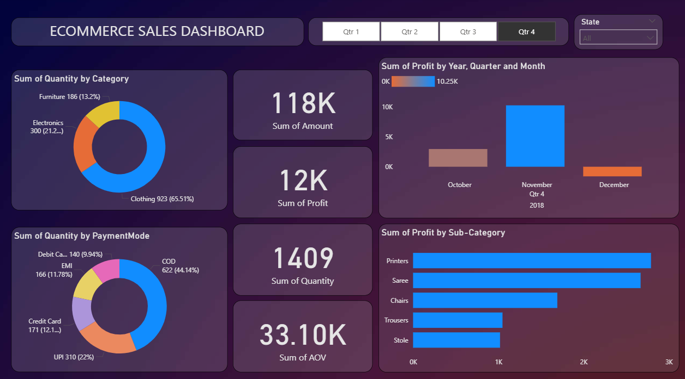

# 📊 E-Commerce Sales Dashboard – Power BI

This Power BI project presents a visually engaging and interactive **E-commerce Sales Dashboard** designed to analyze sales performance across categories, time periods, and payment modes. It helps stakeholders gain insights into key metrics like profit, quantity, and average order value (AOV).

---

## 🖼️ Dashboard Screenshot

---

## 🔍 Key Features

- 📅 **Quarterly Analysis**: Dynamic slicers to filter data by quarters (Q1–Q4).
- 🛍️ **Category Breakdown**: Donut chart showing quantity distribution by product category.
- 💳 **Payment Mode Insights**: Payment method preferences visualized clearly.
- 📈 **Profit Trends**: Monthly profit analysis across selected quarters.
- 📦 **Sub-Category Performance**: Bar chart highlighting top-performing sub-categories.
- 📊 **KPIs**:
  - Total Sales Amount
  - Total Profit
  - Total Quantity Sold
  - Average Order Value (AOV)

---

## 📁 Files Included

- `Ecommerce_Sales_Dashboard.pbix`: Main Power BI report file.
- `dashboard.png`: Screenshot of the dashboard (used above).
- `README.md`: This documentation.

---

## 🚀 How to Use

1. Open the `.pbix` file in Power BI Desktop.
2. Interact with slicers to explore the data across time periods and segments.
3. Customize the visualizations or connect to your own data source if needed.

---

## 📌 Requirements

- Power BI Desktop (latest version recommended)

---

## 📧 Contact

For any questions or feedback, feel free to reach out via [manishhkapal@gmail.com].

---

